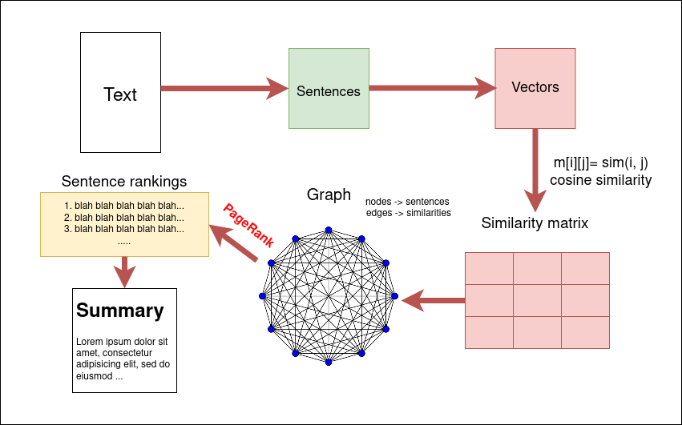
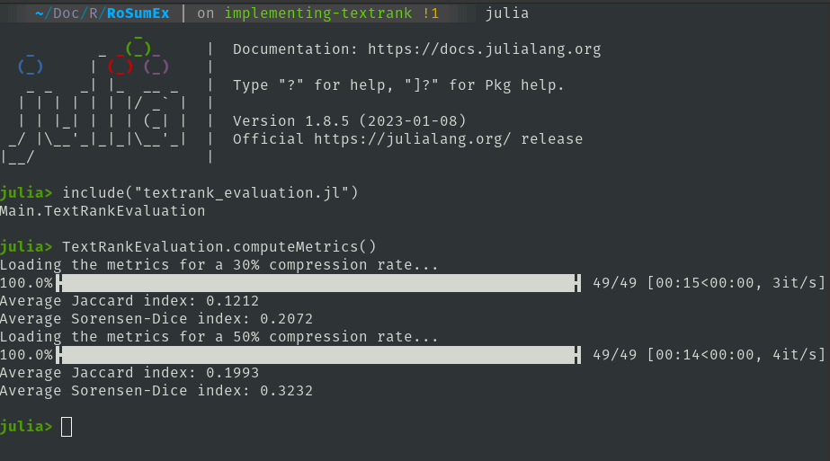

# RoSumEx

Extractive summarization in Romanian using [TextRank](https://web.eecs.umich.edu/~mihalcea/papers/mihalcea.emnlp04.pdf).

## Instructions

```
    Usage: 
       julia rosumex.jl [filename] [rate]

    Args:
       filename -> The name of the file containing the Romanian text.
                   Please write a filename like [1-50].txt. Keep in  
                   mind that file 43.txt does not exist, so it is an
                   invalid parameter.
           rate -> The compression rate of the text. It should be a 
                   number in the range (0, 1).

    Example: julia rosumex.jl 1.txt 0.5
```

## Diagram



## Description

TextRank is an algorithm used for automatic text summarization and keyword extraction. It is inspired by Google's PageRank and operates by treating the text as a graph. Each sentence or word is considered a node, and the relationships between them are represented as edges. In this project, the extractive summarization is based on sentences, so each sentence of the input text represents a node in the graph. The algorithm follows these steps:

1. Preprocessing the text by removing irrelevant elements.
2. Representing each sentence or word as a node, typically using a bag-of-words or word embeddings approach.
3. Constructing a graph where nodes represent sentences or words, and edges indicate their similarity.
4. Ranking the nodes in the graph iteratively by updating their scores based on the scores of neighboring nodes.
5. Extracting the top-ranked sentences or words as the summary or keywords, respectively.

TextRank is widely used in natural language processing tasks and offers a simple yet effective way to extract important information from texts without requiring training data.

## PageRank formula
$$Pr(V_i) = \frac{(1 - d)}{N} + d \cdot \sum_{V_j \in In(V_i)} \frac{Pr(V_j)}{\lvert Out(V_j) \rvert}$$

where $Pr(V_i)$ represents the rank of the node $V_i$, $N$ is the total number of nodes, $d$ is the damping factor parameter, $In(V_i)$ represents the neighbours having edges that enter $V_i$ and $\lvert Out(V_j) \rvert$ is the number of outgoing neighbours of $V_j$. 

One thing to note is that the damping factor represents the probability of a "random surfer" clicking a link and continuing the navigation process further. By default, this parameter has the value of $0.85$.

## TextRank formula

$$Tr(V_i) = \frac{(1 - d)}{N} + d \cdot \sum_{V_j \in In(V_i)} \frac{w_{j \,i} \cdot Tr(V_j)}{\sum_{V_k \in Out(V_j)} w_{j\,k}}$$

Similarly, TextRank has an almost identical formula like PageRank's. However, it also takes into account the weights of the graph's edges. In our case, these are the $w_{j\.i}$ and $w_{j\.k}$ values seen in the terms of the sum. These are obtained by computing the cosine distance between two sentences. The representation of a sentence is a vector of frequencies with the length equal to the size of the set of words in the given input text. 

## Libraries used

- [WordTokenizers.jl](https://github.com/JuliaText/WordTokenizers.jl) $\quad\rightarrow\quad$    A Julia library containing NLP tokenization tools
- [Languages.jl](https://github.com/JuliaText/Languages.jl)$\quad\rightarrow\quad$ Julia package containing NLP tools for various languages
- [ProgressBars.jl](https://juliapackages.com/p/progressbars) $\quad\rightarrow\quad$ Julia library for displaying progress/loading bars.

## Metrics

### Jaccard Index

$$J(A, B) = \frac{\lvert A \cap B \rvert}{\lvert A \cup B \rvert}$$

where $A$ and $B$ are the set of sentence indexes created by TextRank and the labels from the labeled Romanian text samples 

### Sørensen–Dice index

$$ DSC(X, Y) = \frac{2 \cdot \lvert X \cap Y \rvert}{\lvert X \rvert + \lvert Y \rvert } $$

## Results
Currently, for a $30\%$ compression rate, the average Jaccard index is $0.121$, a very small value, while the average Sørensen–Dice index is $0. 2072$. A similar output is given for a $50\%$ compression rate. However, the assumption is that the weak vector representation that was chosen is the cause of this issue.



## Future improvements
- Currently, the vector representation is created with simple word frequencies. However, there are better representations that can be chosen: TF-IDF, Word2Vec word embeddings etc.
